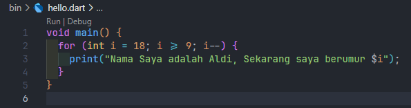
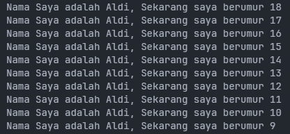

# PERTEMUAN 2 - Pengantar Bahasa Pemrograman Dart - Bagian 1

> Nama : Zanuar Aldi Syahputra  
> Kelas : SIB 2B  
> NIM : 2241760062

## SOAL 1
 
Modifikasilah kode pada baris 3 di VS Code atau Editor Code favorit Anda berikut ini agar mendapatkan keluaran (output) sesuai yang diminta!

Output yang diharapkan:

**JAWABAN**

- Code 

    

- Output

    

## SOAL 2
 
Mengapa sangat penting untuk memahami bahasa pemrograman Dart sebelum kita menggunakan framework Flutter ? Jelaskan!

**JAWABAN**

Pentingnya memahami bahasa pemrograman dart karena flutter dibangun menggunakan dart sebagai bahasa pemrograman utamanya. Dan juga dart memiliki sintaks dan fitur khusus yang digunakan secara ekstensif dalam pengembangan flutter.

## SOAL 3
 
Rangkumlah materi dari codelab ini menjadi poin-poin penting yang dapat Anda gunakan untuk membantu proses pengembangan aplikasi mobile menggunakan framework Flutter.

**JAWABAN**

Dart bertujuan untuk menggabungkan kelebihan-kelebihan dari sebagian besar bahasa tingkat tinggi dengan fitur-fitur bahasa pemrograman terkini, antara lain sebagai berikut:

- **Productive tooling**: merupakan fitur kakas (tool) untuk menganalisis kode, plugin IDE, dan ekosistem paket yang besar.
- **Garbage collection**: untuk mengelola atau menangani dealokasi memori (terutama memori yang ditempati oleh objek yang tidak lagi digunakan).
- **Type annotations (opsional)**: untuk keamanan dan konsistensi dalam mengontrol semua data dalam aplikasi.
- **Statically typed**: Meskipun type annotations bersifat opsional, Dart tetap aman karena menggunakan fitur type-safe dan type inference untuk menganalisis types saat runtime. Fitur ini penting untuk menemukan bug selama kompilasi kode.
- **Portability**: bahasa Dart tidak hanya untuk web (yang dapat diterjemahkan ke JavaScript) tetapi juga dapat dikompilasi secara native ke kode Advanced RISC Machines (ARM) dan x86.

