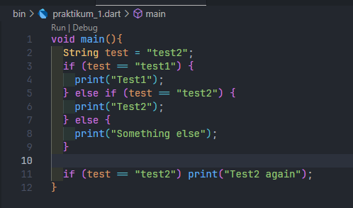
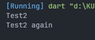
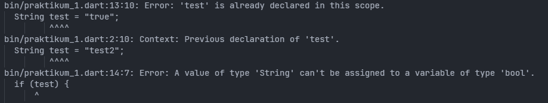
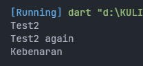
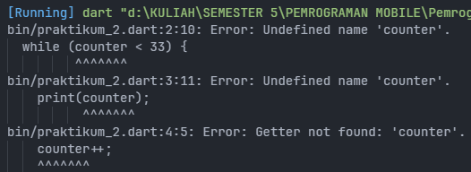
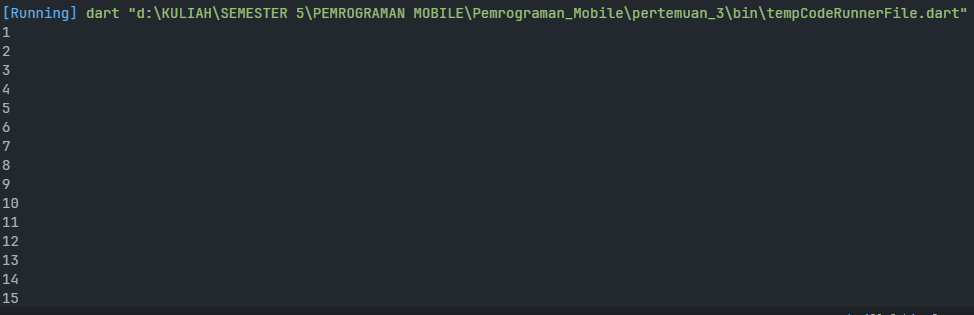
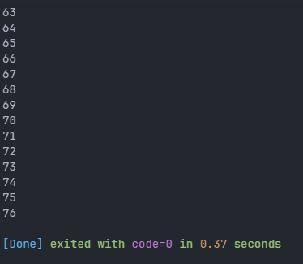
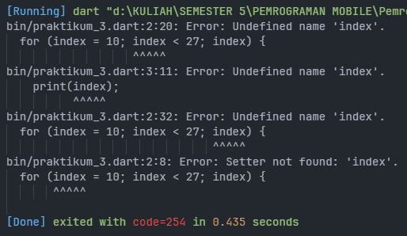
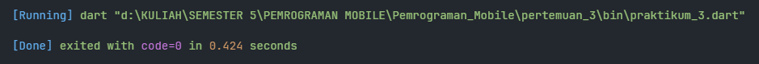
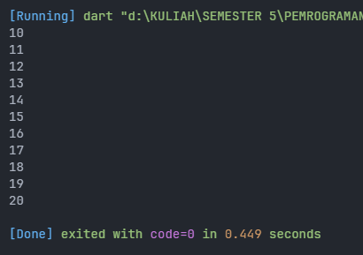

# PERTEMUAN 3 - Pengantar Bahasa Pemrograman Dart - Bagian 2

> Nama : Zanuar Aldi Syahputra <br>
> Kelas : SIB 2B <br>
> NIM : 2241760062

## TUGAS PRAKTIKUM

### SOAL 1
Silakan selesaikan Praktikum 1 sampai 3, lalu dokumentasikan berupa screenshot hasil pekerjaan beserta penjelasannya!

### SOAL 2
Buatlah sebuah program yang dapat menampilkan bilangan prima dari angka 0 sampai 201 menggunakan Dart. Ketika bilangan prima ditemukan, maka tampilkan nama lengkap dan NIM Anda.

### SOAL 3
Kumpulkan berupa link commit repo GitHub pada tautan yang telah disediakan di grup Telegram!

**JAWABAN**

### SOAL 1

#### PRAKTIKUM 1

##### LANGKAH 1

Ketik atau salin kode program berikut ke dalam fungsi main().

```dart
String test = "test2";
if (test == "test1") {
   print("Test1");
} else If (test == "test2") {
   print("Test2");
} Else {
   print("Something else");
}

if (test == "test2") print("Test2 again");
```

**JAWABAN**



##### LANGKAH 2

Silakan coba eksekusi (Run) kode pada langkah 1 tersebut. Apa yang terjadi? Jelaskan!

**JAWABAN**



Dari kode tersebut diawali dengan membuat sebuah variabel bernama `test` bertipe data `String` yang bernilai `test2`. kemudian dilakukan percabangan jika nilai variabel `test` bernilai `test1` maka akan memberikan output `Test1` lalu jika bernilai `test2` maka memberikan output `Test2` dan jika bukan keduanya maka akan memberikan output  `Something else`. Dan karena variabel `test` bernilai `test2` maka akan mengeluarkan output `Test2`. Kemudian dilakukan percabangan lagi dengan kondisi jika `test` bernilai `test2` maka akan mengeluarkan output `Test 2 again` 

##### LANGKAH 3

Tambahkan kode program berikut, lalu coba eksekusi (Run) kode Anda.

```dart
String test = "true";
if (test) {
   print("Kebenaran");
}
```
Apa yang terjadi ? Jika terjadi error, silakan perbaiki namun tetap menggunakan if/else.

**JAWABAN**

Terjadi error karena variabel `test` sudah dibuat sebelumnya, jadi ketika diinisiasikan kembali maka akan terjadi error. Error lainnya yaitu pada percabangannya yaitu `if(test)` ini hanya bisa dilakukan jika variabel bertipe data boolean.



Solusinya untuk mengatasi error yaitu kode diubah menjadi seperti berikut.

```dart
void main(){
  String test = "test2";
  if (test == "test1") {
    print("Test1");
  } else if (test == "test2") {
    print("Test2");
  } else {
    print("Something else");
  }

  if (test == "test2") print("Test2 again");

  test = "true";
  if (test == "true") {
    print("Kebenaran");
  }
}
```


#### PRAKTIKUM 2

##### LANGKAH 1

Ketik atau salin kode program berikut ke dalam fungsi main().

```dart
while (counter < 33) {
  print(counter);
  counter++;
}
```

##### LANGKAH 2

Silakan coba eksekusi (Run) kode pada langkah 1 tersebut. Apa yang terjadi? Jelaskan! Lalu perbaiki jika terjadi error.

**JAWABAN**



Terjadi error karena variabel `counter` tidak diinisiasi jadi ketika variabel ini dipanggil maka akan terjadi error. Untuk mengatasi error ini kode diubah menjadi seperti berikut.

```dart
void main() {
  int counter = 1;
  while (counter < 33) {
    print(counter);
    counter++;
  }
}
```


##### LANGKAH 3

Tambahkan kode program berikut, lalu coba eksekusi (Run) kode Anda.

```dart
do {
  print(counter);
  counter++;
} while (counter < 77);
```
Apa yang terjadi ? Jika terjadi error, silakan perbaiki namun tetap menggunakan do-while.

**JAWABAN**

Tidak terjadi error ketika ditambahkan kode diatas. Yang terjadi adalah terjadi perulangan yang memberikan output nilai dari variabel `counter`. Ada 2 jenis perulangan yang digunakan yaitu perulangan `while` dan perulangan `do-while`. Perulangan `while` akan terus berjalan selama nilai variabel `counter` berada dibawah 33 dan perulangan `do-while` dilakukan dengan kondisi jika variabel `counter` bernilai dibawah 77.



#### PRAKTIKUM 3

##### LANGKAH 1

Ketik atau salin kode program berikut ke dalam fungsi main().

```dart
for (index = 10; index < 27; index) {
  print(index);
}
```

##### LANGKAH 2

Silakan coba eksekusi (Run) kode pada langkah 1 tersebut. Apa yang terjadi? Jelaskan! Lalu perbaiki jika terjadi error.

**JAWABAN**



Terjadi error karena variabel `index` dipanggil/digunakan tanpa dilakukan inisiasi. Dan juga untuk perulangannya akan terjadi nested loop karena nilai variabel `index` tidak berubah nilainya. Dan untuk solusinya yaitu kode diubah menjadi seperti berikut.

```dart
void main() {
  for (int index = 10; index < 27; index++) {
    print(index);
  }
}
```

Untuk outputnya menjadi seperti berikut:



##### LANGKAH 3

Tambahkan kode program berikut di dalam for-loop, lalu coba eksekusi (Run) kode Anda.

```dart
if (index == 21) break;
else if (index > 1 || index < 7) continue;
print(index);
```
Apa yang terjadi ? Jika terjadi error, silakan perbaiki namun tetap menggunakan for dan break-continue.

**JAWABAN**

Sebenarnya tidak terjadi error tetapi output tidak muncul karena ada kesalahan pada percabangan `else if(index > 1 || index < 7) continue` karena setiap perulangannya akan di continue karena nilainya selalu `true`. Dan juga statement didalam percabangan baik itu `if` ataupun `else if` harus didalam block atau didalam kurung kurawal `{}`. 


Dan solusi untuk mengatasi ini yaitu kode diubah menjadi sebagai berikut.

```dart
void main() {
  for (int index = 10; index < 27; index++) {
    if (index == 21) {
      break;
    } else if (index > 1 && index < 7) {
      continue;
    }
    print(index);
  }
}
```

Dan outputnya akan menjadi seperti berikut.




## CHALLENGE

> Dalam pengerjaan